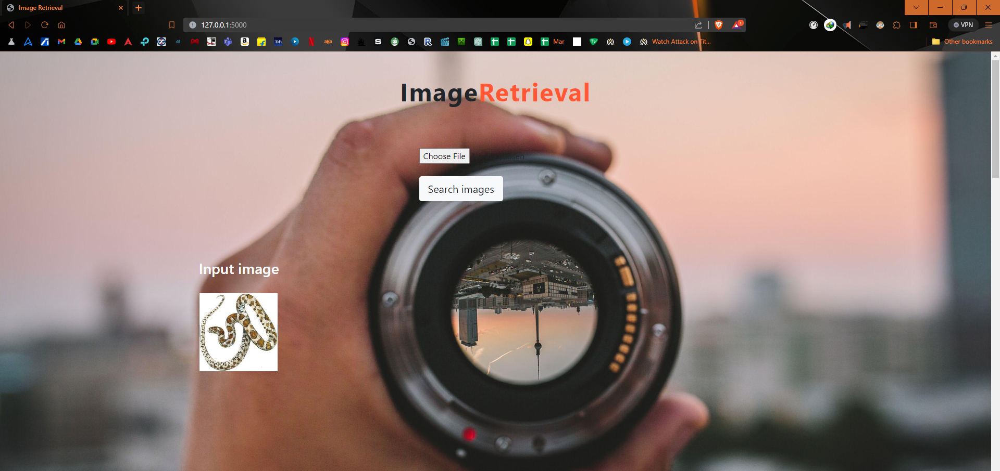
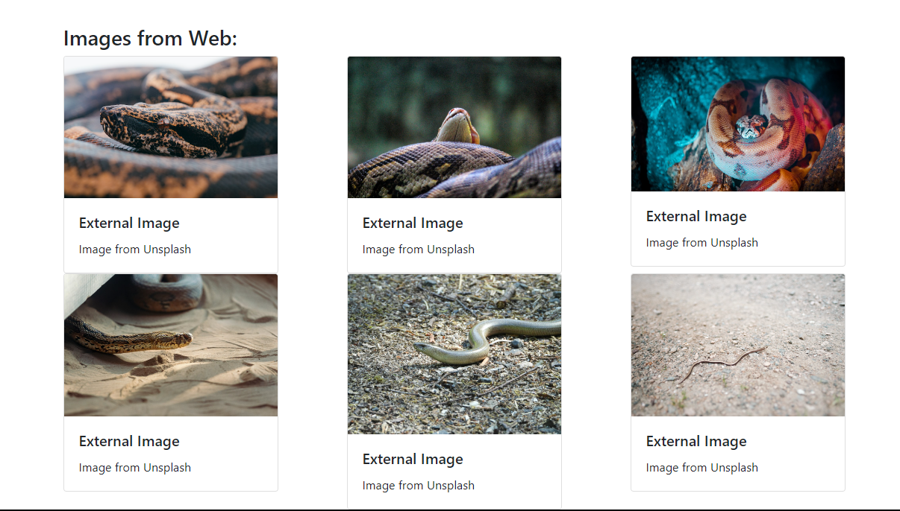

# Content-Based Image Retrieval (CBIR) System


This repository features a Content-Based Image Retrieval (CBIR) system implemented in Python using TensorFlow, VGG-16, and Flask. The system is designed to retrieve visually similar images from the Caltech256 dataset. The Flask application utilizes various functionalities, including file handling, image processing, and integration with a pre-trained VGGNet model. The extracted features are stored in an H5 file, and the Flask app allows users to upload images, perform image similarity searches, and view the results. Additionally, the system incorporates a function to fetch external images from Unsplash based on the predicted image category. The code includes routes for the home page, image description page, and an about page. The repository aims to provide an interactive and visually engaging image retrieval experience.

## Prerequisites

- Python 3.10
- TensorFlow
- Keras
- Flask
- Other dependencies (See `tensorflow.yml` and `requirements.txt`)

## Dataset

The system uses the [Caltech256 dataset](https://data.caltech.edu/records/nyy15-4j048). Please download the dataset from the official website.

## CBIR Model Execution and Feature Training

1. Open the Jupyter Notebook file `CBIR.ipynb` in a Jupyter Notebook environment.
2. Follow the instructions provided within the notebook to run the CBIR system.

## Direct Usage

1. Activate the virtual environment (if used). Install all dependencies from `tensorflow.yml` and `requirements.txt`
2. Change the directory to `flaskCBIR`.

    ```bash
    cd flaskCBIR
    ```

3. Run the Flask application using the following command:

    ```bash
    python3 CBIR_app.py
    ```

## Output

1. Visit the home page at [http://localhost:5000/](http://localhost:5000/).
2. Upload an image to find visually similar images from the dataset.
3. Explore the search results and click on images for detailed descriptions.





## License
This project is licensed under the terms of the LICENSE file.

## Contributing

Feel free to contribute to this project by opening issues or submitting pull requests. Your contributions are highly appreciated!

**Note:** Please ensure that you have the required dependencies installed and have downloaded the Caltech256 dataset before running the system.

Happy image retrieval!
